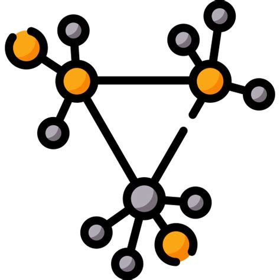
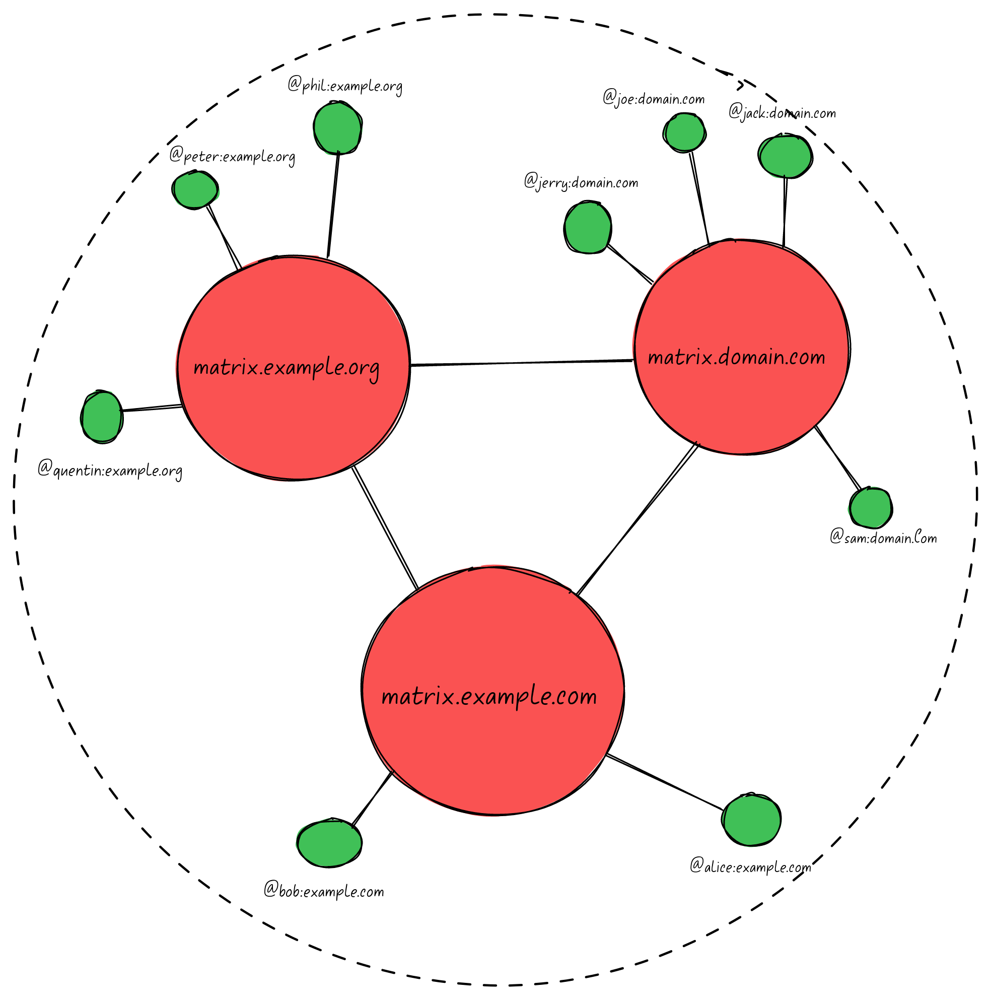
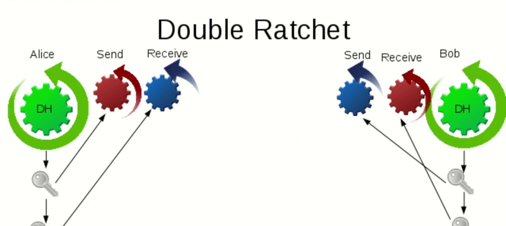
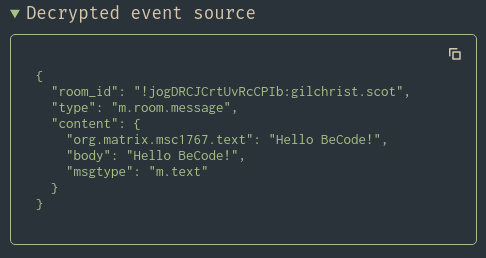
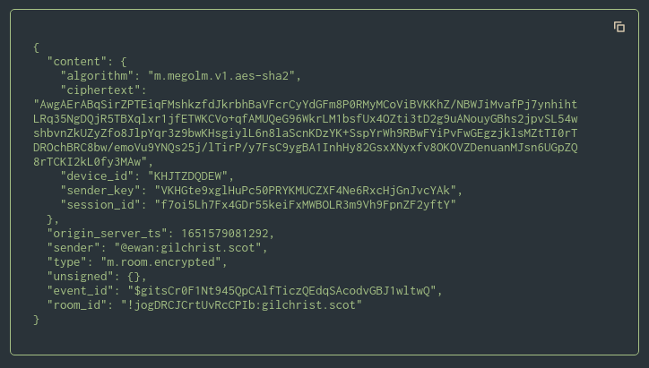
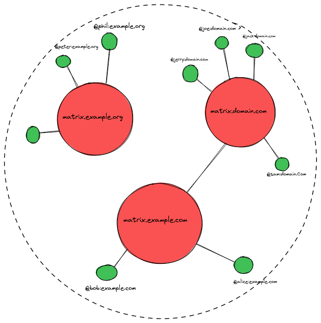
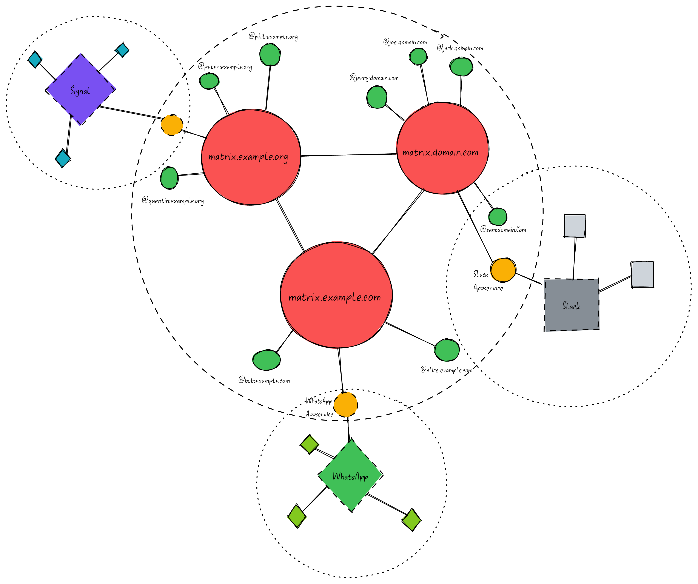

<!-- _class: lead -->

# The Matrix Protocol

An open network for secure, decentralized communication

---

# What is it?

- An open source project that governs the publication of an open specification of the Matrix communication standard.

- This consists of:
  - Client - Server API
  - Server - Server API
  - Application Service API
  - Reference Implementation of Servers and Clients

---

### Matrix is..

- _Decentralised_
- _Secure_
- _Persistent_
- _Interoperable_

---

<!-- _class: lead -->

# Matrix is... Decentralised

Users join a homeserver on a particular domain. All homeservers can federate with each other.

---

---

---

<!-- _class: lead -->

# Matrix is.... Secure

Messages are by default encrypted using Olm, based on Signal's Double Ratchet Algorithm

---

---

<!-- backgroundColor: #2a3339 -->

---

<!-- backgroundColor: #2a3339 -->

---

<!-- backgroundColor: white -->
<!-- _class: lead -->

# Matrix is ... Persistent

Participating Servers all replicate the history of a given Matrix Room, no one server "_owns_" the room.

---

Room: `#example-room:example.com`

Client:

`POST /_matrix/client/v3/rooms/{roomId}/invite`

---

Client:

`POST /_matrix/client/v3/rooms/{roomId}/invite`

Server:

`PUT /_matrix/federation/v1/send_join/{roomId}/{eventId}`

---

# Matrix is... Interoperable

The Appservice API allows dedicated applications to act as bridges to other platforms.   For example:

- WhatsApp (https://github.com/mautrix/whatsapp)
- Signal (https://github.com/mautrix/signal)
- Slack (https://github.com/matrix-org/matrix-appservice-slack)
- Discord (https://github.com/Half-Shot/matrix-appservice-discord)

---

---

<!-- _class: lead -->

# Why Matrix?

---

<!-- _class: lead -->

# Time for A Demo!
