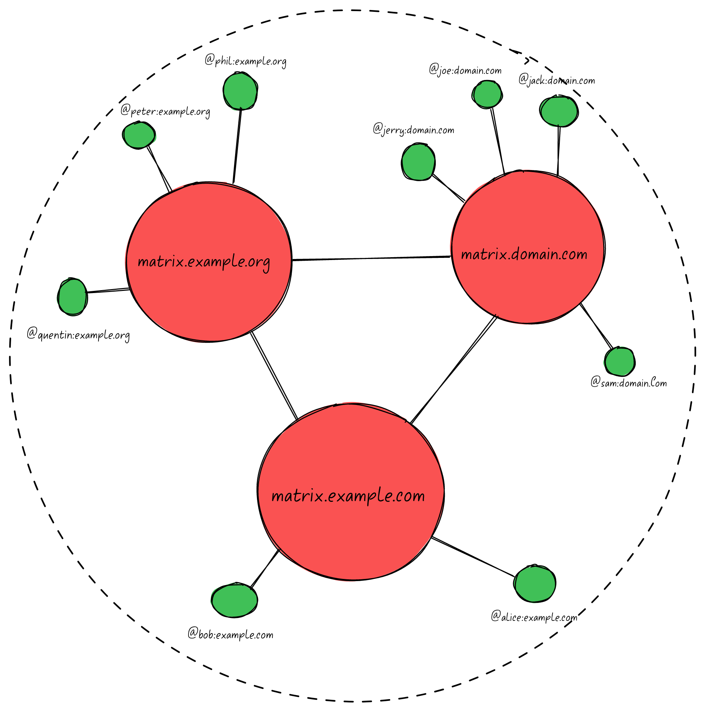
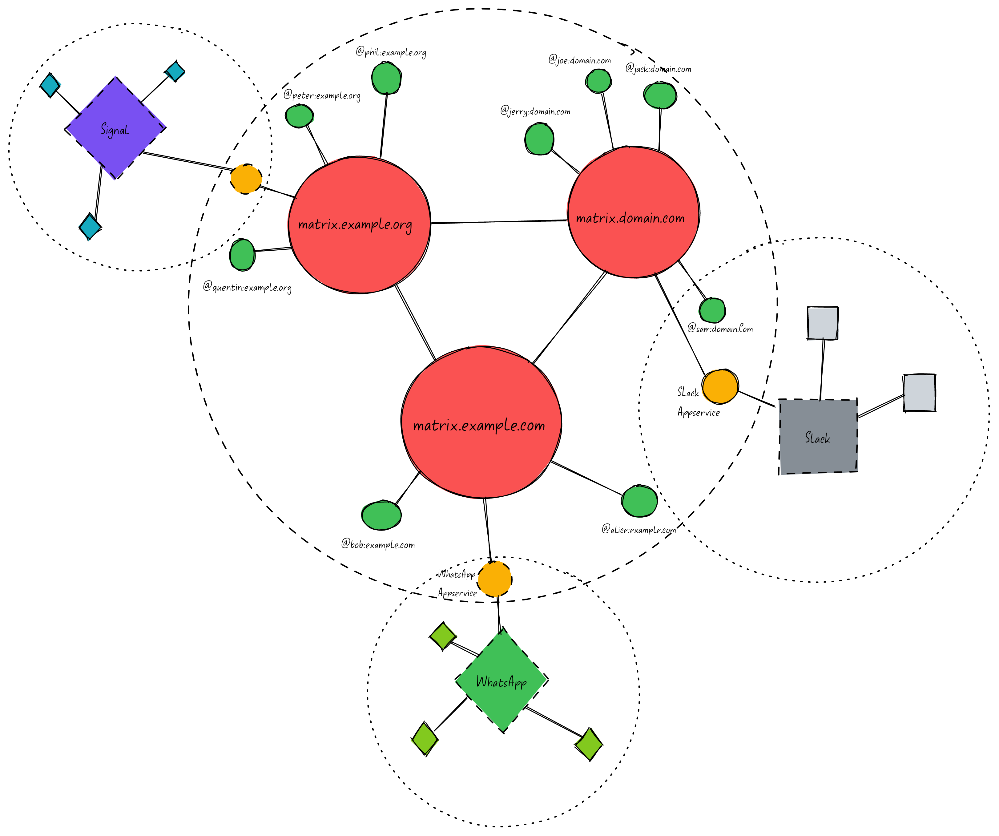

<!-- _class: lead -->

# The Matrix Protocol

An open network for secure, decentralized communication

---

# What is it?

- An open source project that governs the publication of an open specification of the Matrix communication standard.

- This consists of:
  - Client - Server API
  - Server - Server API
  - Application Service API
  - Reference Implementation of Servers and Clients

---

### Matrix is..

- _Decentralised_
  - Users have a homeserver on a particular domain, and all homeservers can federate with each other
- _Secure_
  - Messages are by default encrypted using Olm, based on Signal's Double Ratchet Algorithm
- _Persistent_
  - Participating Servers all replicate the history of a given Matrix Room, no one server "_owns_" the room.

---

<!-- _class: lead -->

# Matrix Network Topology

---

---

---

